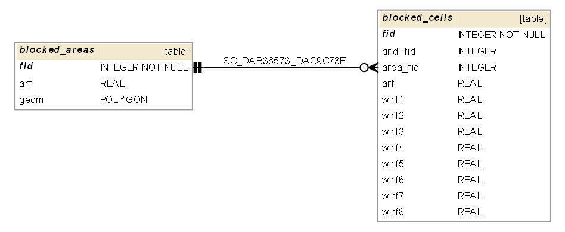

## ARF.DAT 

Data goes into the following GeoPackage tables:

* cont - global ARF value for ITTAWF grid cells
* blocked_areas_tot - polygon layer with totally blocked out cells (ITTAWF type cells)
* blocked_cells_tot - grid cells totally blocked out (ITTCHAR=T, line 1)
* blocked_areas - polygon layer with individual ARF values 
* blocked_cells - cells with individual ARF values

**gpkg table: cont** (global model parameters table)

* add parameter: name="arfblockmod", value=0-1

**gpkg table: blocked_areas** (areas with grid cells with individual ARF) 

* "fid" INTEGER NOT NULL PRIMARY KEY,
* "arf" REAL, -- ARF, area reduction factor for the cell

**gpkg table: blocked_cells** (grid cells partially blocked) - filled by a geoprocessing trigger based on polygons from blocked_areas table

* "fid" INTEGER NOT NULL PRIMARY KEY,  
* "grid_fid" INTEGER, -- equal to fid from grid table
* "area_fid" INTEGER -- fid of area from blocked_areas table
* "wrf1" REAL, -- WRF(I,J), width reduction factor for the North direction
* "wrf2" REAL, -- WRF(I,J), width reduction factor for the East direction
* "wrf3" REAL, -- WRF(I,J), width reduction factor for the South direction
* "wrf4" REAL, -- WRF(I,J), width reduction factor for the West direction
* "wrf5" REAL, -- WRF(I,J), width reduction factor for the Northeast direction
* "wrf6" REAL, -- WRF(I,J), width reduction factor for the Southeast direction
* "wrf7" REAL, -- WRF(I,J), width reduction factor for the Southwest direction
* "wrf8" REAL, -- WRF(I,J), width reduction factor for the Northwest direction
