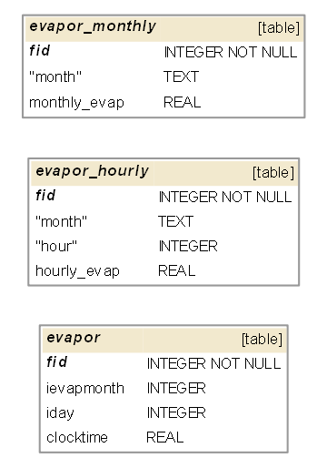

## EVAPOR.DAT 

EVAPOR.DAT information goes into the following GeoPackage tables:

* evapor - general evaporation data
* evapor_monthly - monthly evaporation rate
* evapor_hourly - hourly percentage of the daily total evaporation for each month

**gpkg table: evapor** (contains general evaporation data)

* "fid" INTEGER NOT NULL PRIMARY KEY,
* "ievapmonth" INTEGER, -- IEVAPMONTH, starting month of simulation
* "iday" INTEGER, -- IDAY, starting day of the week (1-7)
* "clocktime" REAL -- CLOCKTIME, starting clock time

**gpkg table: evapor_monthly** (monthly evaporation rate data)

* "fid" INTEGER NOT NULL PRIMARY KEY,
* "month" TEXT, -- EMONTH, name of the month
* "monthly_evap" REAL -- EVAP, monthly evaporation rate

**gpkg table: evapor_hourly** (hourly percentage of the daily total evaporation for each month)

* "fid" INTEGER NOT NULL PRIMARY KEY,
* "month" TEXT, -- EMONTH, name of the month
* "hour" INTEGER, -- hour of the day (1-24)
* "hourly_evap" REAL -- EVAPER, hourly percentage of the daily total evaporation

