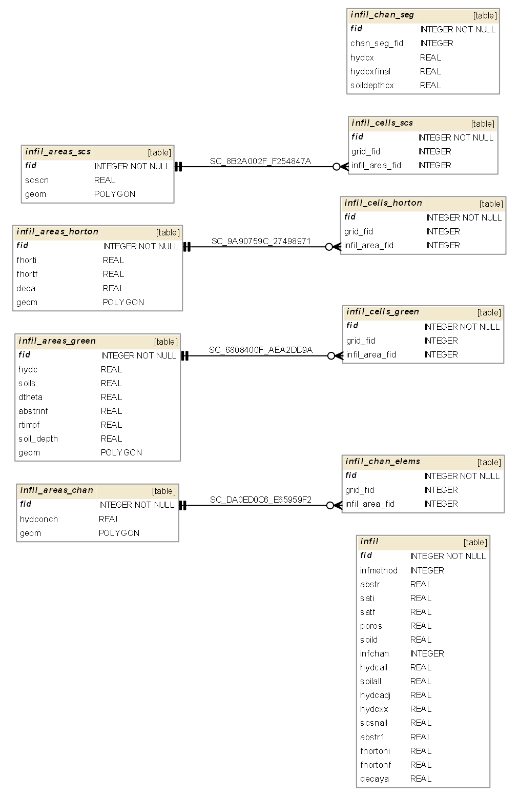

## INFIL.DAT 

INFIL.DAT information goes into the following GeoPackage tables:

* infil - general infiltration data
* infil_areas_green - polygon layer with individual FLOODPLAIN infiltration parameters for Green Ampt (INFILCHAR=F, line 6)
* infil_cells_green - grid cells located inside infil_areas_green polygons, having individual infiltration params
* infil_areas_scs - polygon layer with individual FLOODPLAIN infiltration parameters for SCS (INFILCHAR=S, line 7)
* infil_cells_scs - grid cells located inside infil_areas_scs polygons, having individual infiltration params
* infil_areas_horton - polygon layer with individual FLOODPLAIN infiltration parameters for Horton (INFILCHAR=H, line 10)
* infil_cells_horton - grid cells located inside infil_areas_horton polygons, having individual infiltration params
* infil_areas_chan - polygon layer with individual CHANNEL infiltration parameters (INFILCHAR=C, line 8)
* infil_chan_elems - channel elements located inside infil_areas_chan polygons, having individual infiltration params
* infil_chan_seg - infiltration parameters for segments/reaches (INFILCHAR=R, line 4, 4a)

**gpkg table: infil** (contains general info about infiltration)

* "fid" INTEGER NOT NULL PRIMARY KEY,
* "infmethod" INTEGER, -- INFMETHOD, infiltration method number
* "abstr" REAL, -- ABSTR, Green Ampt global floodplain rainfall abstraction or interception
* "sati" REAL, -- SATI, Global initial saturation of the soil
* "satf" REAL, -- SATF, Global final saturation of the soil
* "poros" REAL, -- POROS, global floodplain soil porosity
* "soild" REAL, -- SOILD, Green Ampt global soil limiting depth storage
* "infchan" INTEGER, -- INFCHAN, switch for simulating channel infiltration
* "hydcall" REAL, -- HYDCALL, average global floodplain hydraulic conductivity
* "soilall" REAL, -- SOILALL, average global floodplain capillary suction
* "hydcadj" REAL, -- HYDCADJ, hydraulic conductivity adjustment variable 
* "hydcxx" REAL, -- HYDCXX, global channel infiltration hydraulic conductivity
* "scsnall" REAL, -- SCSNALL, global floodplain SCS curve number
* "abstr1" REAL, -- ABSTR1, SCS global floodplain rainfall abstraction or interception
* "fhortoni" REAL, -- FHORTONI, global Horton’s equation initial infiltration rate 
* "fhortonf" REAL, -- FHORTONF, global Horton’s equation final infiltration rate 
* "decaya" REAL, --DECAYA, Horton’s equation decay coefficient

**gpkg table: infil_chan_seg** (individual channel segment infiltration params)

* "fid" INTEGER NOT NULL PRIMARY KEY,
* "chan_seg_fid" INTEGER, -- channel segment fid from chan table
* "hydcx" REAL, -- HYDCX, initial hydraulic conductivity for a channel segment
* "hydcxfinal" REAL, -- HYDCXFINAL, final hydraulic conductivity for a channel segment
* "soildepthcx" REAL -- SOILDEPTHCX, maximum soil depth for the initial channel infiltration

**gpkg table: infil_areas_green** (areas of different floodplain infiltration data for Green Ampt)

* "fid" INTEGER NOT NULL PRIMARY KEY,
* "hydc" REAL, -- HYDC, grid element average hydraulic conductivity 
* "soils" REAL, -- SOILS, capillary suction head for floodplain grid elements
* "dtheta" REAL, -- DTHETA, grid element soil moisture deficit
* "abstrinf" REAL -- ABSTRINF, grid element rainfall abstraction
* "rtimpf" REAL, -- RTIMPF, percent impervious floodplain area on a grid element
* "soil_depth" REAL, -- SOIL_DEPTH, maximum soil depth for infiltration on a grid element
* "geom" POLYGON

**gpkg table: infil_cells_green** (grid elements with a different floodplain infiltration data for Green Ampt)

* "fid" INTEGER NOT NULL PRIMARY KEY,
* "grid_fid" INTEGER, -- grid element number from grid table
* "infil_area_fid" INTEGER, -- polygon fid from infil_areas_green table

**gpkg table: infil_areas_scs** (areas of different floodplain infiltration data for SCS)

* "fid" INTEGER NOT NULL PRIMARY KEY,
* "scscn" REAL, -- SCSCN, SCS curve numbers of the floodplain grid elements
* "geom" POLYGON

**gpkg table: infil_cells_scs** (grid elements with a different floodplain infiltration data for SCS)

* "fid" INTEGER NOT NULL PRIMARY KEY,
* "grid_fid" INTEGER, -- grid element number from grid table
* "infil_area_fid" INTEGER, -- polygon fid from infil_areas_scs table

**gpkg table: infil_areas_horton** (areas of different floodplain infiltration data for Horton)

* "fid" INTEGER NOT NULL PRIMARY KEY,
* "fhorti" REAL, -- FHORTI, Horton’s equation floodplain initial infiltration rate
* "fhortf" REAL, -- FHORTF, Horton’s equation floodplain final infiltration rate
* "deca" REAL, --DECA, Horton’s equation decay coefficient
* "geom" POLYGON

**gpkg table: infil_cells_horton** (grid elements with a different floodplain infiltration data for Horton)

* "fid" INTEGER NOT NULL PRIMARY KEY,
* "grid_fid" INTEGER, -- grid element number from grid table
* "infil_area_fid" INTEGER, -- polygon fid from infil_areas_horton table

**gpkg table: infil_areas_chan** (areas of individual CHANNEL infiltration parameters)

* "fid" INTEGER NOT NULL PRIMARY KEY,
* "hydconch" REAL, -- HYDCONCH, hydraulic conductivity for a channel element
* "geom" POLYGON

**gpkg table: infil_chan_elems** (channel elements having individual infiltration params)

* "fid" INTEGER NOT NULL PRIMARY KEY,
* "grid_fid" INTEGER, -- grid element number from grid table
* "infil_area_fid" INTEGER, -- polygon fid from infil_areas_chan table

